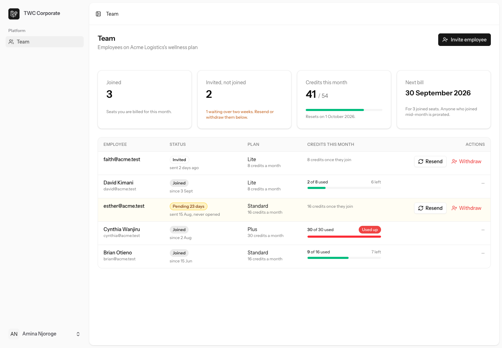

# TWC Corporate

The corporate product from the take-home brief: a company admin invites employees, the company pays for the seats that actually get used, and the admin sees where the credits are going.



More states in [docs/screenshots](docs/screenshots): [after an invite](docs/screenshots/team-after-invite.png), [all credits used](docs/screenshots/team-credits-exhausted.png), [no employees yet](docs/screenshots/team-empty.png), [a suspended seat](docs/screenshots/team-suspended.png), [what that employee sees](docs/screenshots/employee-suspended.png), [the invitation email](docs/screenshots/invite-email.png), [the invite landing page](docs/screenshots/invite-accept.png) and [the employee's dashboard](docs/screenshots/employee-dashboard.png).

## Running it

```bash
createdb twc                      # Postgres, or point .env at your own
cp .env.example .env && composer install && npm install
php artisan key:generate && php artisan migrate --seed
npm run build                     # or `composer run dev` for hot reload
```

Served by Herd at http://twc.test. Invite emails go out over SMTP: `.env.example` points at Mailpit on port 1025 (UI at http://localhost:8025), or set `MAIL_MAILER=log` to just write them to the log. Three seeded companies (password is `password` everywhere):

| Company        | Admin login       | API token           | What it shows                                                          |
| -------------- | ----------------- | ------------------- | ---------------------------------------------------------------------- |
| Acme Logistics | amina@acme.test   | `acme-admin-token`  | A working team, one seat out of credits, an invite pending three weeks |
| Beta Bank      | bob@betabank.test | `beta-admin-token`  | Every seat has used its allowance                                      |
| Cedar Studio   | carol@cedar.test  | `cedar-admin-token` | Nobody invited yet                                                     |

```bash
curl -H "Authorization: Bearer acme-admin-token" http://twc.test/api/company/users
curl -H "Authorization: Bearer acme-admin-token" -H "Content-Type: application/json" \
     -d '{"email":"new@acme.test","plan_id":2}' http://twc.test/api/company/invites
curl -H "Content-Type: application/json" \
     -d '{"token":"<invite_token from above>","name":"New Person"}' http://twc.test/api/invites/accept
```

Also `POST /api/company/invites/{id}/resend` and `DELETE /api/company/invites/{id}` for stale invites, and `POST /api/company/users/{id}/suspend`, `POST /api/company/users/{id}/resume` and `DELETE /api/company/users/{id}` for people who have joined. The company is always taken from the caller's token, never from the request, so there is no id to tamper with. Invite and resend both email the employee their link; the token is also returned in the response, as the brief asks, so the flow can be exercised without a mailbox.

## The staff console

Not in the brief, added afterwards: TWC's own view at `/admin` for the `staff` role. It shows an overview (companies, seats, pending and stale invites, active subscriptions, monthly run-rate, credits this month), every company with its admins and seat counts, a company page that reuses the team table exactly as the admin sees it plus the subscription history, all subscriptions with an active/ended filter, and all users with search. Its one action is onboarding a company: staff enter the company name and the first admin's name and email, and the admin gets an email to choose a password through the standard reset flow. Company admins and employees get a 403 on any of it. Screenshots: [overview](docs/screenshots/staff-overview.png), [companies](docs/screenshots/staff-companies.png), [one company](docs/screenshots/staff-company.png).

## Data model

`companies` → `sponsorships` → `subscriptions`, with `plans` and a `credit_transactions` ledger.

- A **sponsorship** is one invited seat. It is created at invite time (email, plan, token) and gains a `user_id` and `joined_at` when accepted. Keeping the invite and the joined seat in one row means the admin's list is one query, and revoked rows stay as an audit trail.
- A **subscription** is the billable period. It is only created on accept, which is what makes "invite ten, six log in, pay for six" fall out naturally. Plan changes or cancellations would close one and open another, so billing history is never rewritten.
- **Credits are a ledger**, not a counter. Allowances, spends, employee top-ups and expiries are rows, so "credits used this month" is a sum over a date range and the monthly invoice can be reconciled against it.
- Admins are users with `role = company_admin` and a `company_id`. One company per admin, for now. TWC's own people are `role = staff` and belong to no company.

## Stack

Laravel 13 with the Vue starter kit (Inertia, TypeScript, Tailwind) on Postgres. It is what I'm fastest in, and the scaffold gives me validation, form requests, API resources, auth screens and typed routes for free, so the time went on the domain. The API is plain JSON with a bearer token that maps to `users.api_token`; the admin screen calls it the same way curl does, with no privileged path into the backend. This layout is also easy to run next to an existing Xano backend while things migrate, if that is where the stack decision lands.

## Monthly billing

Not built, as asked. The logic I would run at 23:59 Africa/Nairobi on the last day of each month:

```
for each company:
    for each subscription active at any point this month (started ≤ month end, not ended before month start):
        days_active = days from max(started_at, month start) to month end, inclusive
        line = plan.monthly_price × days_active / days_in_month     # full price if it started earlier
        add line to the company's invoice
    charge the company (mock) and store the invoice with its lines

for each subscription still active:
    expire whatever allowance is left (ledger row, negative)
    grant next month's full allowance (ledger row, positive)
```

Employee top-ups are paid by the employee at purchase and never appear on the company invoice. A seat suspended or removed mid-month is billed to month end; no proration on the way out. One line per seat per month, so a seat suspended and resumed in the same month is billed once.

## The reference design

[I have not reviewed the reference yet. Section to be filled in once it is shared.]

## Assumptions where the spec was silent

- A plan is chosen per seat at invite time and the admin can't change it afterwards (cut, see below).
- The billing cycle is the calendar month, billed in arrears on its last day. A seat that joins mid-month is prorated for both price and credits (rounded up, so nobody starts on zero).
- Unused allowance expires at month end. Credits an employee bought themselves don't, and the admin can't see them; that's the employee's money.
- "Accept invite" is the first login. Holding the token proves the inbox, so the account is created verified.
- One live seat per email per company. Revoking an invite frees the email to be invited again.
- Invite tokens don't expire, but an invite unanswered for 14 days is flagged as stale. Resending rotates the token so a forwarded old link dies.
- Someone who already has a personal TWC account joins with that account. Someone already sponsored by another company can't be sponsored twice.
- **Suspend** ends the subscription today and takes back the rest of this month's allowance; the seat stays on the list and can be resumed. Resuming in the same month gives back exactly what that suspension took, which is nothing if the credits were already used, and never grants new ones; resuming in a later month starts a fresh prorated allowance, since nothing was granted for that month. **Remove** does the same to billing but takes the person off the list, returns them to a plain member account, and frees the email to be invited again.
- The run-rate on the staff console is the list price of active seats. It is a pulse, not the invoice; that still needs the billing job.

## What I cut, and what's next

Cut: plan changes, invite expiry, a company-level credit pool, search and pagination on the team list, queueing the invite email, tests.

Next, in order: the month-end billing job above; an estimated next invoice on the team screen so finance isn't surprised; invite expiry at 30 days with a reminder at 7; plan changes with the subscription close-and-reopen rule.

## What I'd test

- **Tenancy**: admin A listing, resending or revoking B's seats gets a 404; a `company_id` in the payload is ignored; an employee's or staff token gets a 403 on the company API; a company admin gets a 403 on `/admin`.
- **Accept**: `joined_at` and the subscription start equal the accept time with a frozen clock; a 16-credit plan joined on the 16th of a 30-day month gets 8 credits; accept twice is 409, revoked is 410, the old token after a resend is 404.
- **Invite**: duplicate per company is 422, revoked or removed email can be re-invited, email is lower-cased.
- **Suspend, resume, remove**: only joined seats can be suspended or removed and only suspended ones resumed (409 otherwise); suspending zeroes what's left this month; resuming in the same month restores it exactly, in a later month prorates afresh; removing returns the user to a member with no company and the same account re-joins on re-invite.
- **List**: credits used only counts the current cycle, stale flips at exactly 14 days, totals match the rows, revoked rows are absent.
- **BillingCycle**: days remaining on the first and last day, February in a leap year, proration rounding up.

Most of the API cases above are already exercised by `scripts/api-smoke.py`, a plain Python script that runs them against a freshly seeded local instance (`php artisan migrate:fresh --seed && python3 scripts/api-smoke.py`). It is not a test suite, but it is what I ran before submitting.

Product improvements are in [PRODUCT.md](PRODUCT.md).
